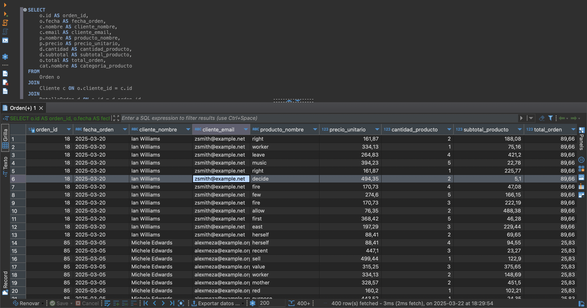

# Mini Tutorial de SQLite con DBeaver

## Instalación de DBeaver
Para comenzar a trabajar con bases de datos en SQLite, te recomendamos instalar DBeaver, un cliente de base de datos universal.

### Pasos de instalación:
1. Descarga DBeaver desde [aquí](https://dbeaver.io/download/).
2. Instala el programa siguiendo las instrucciones del instalador.
3. Abre DBeaver y crea una nueva conexión seleccionando **SQLite**.
4. En la configuración de la conexión, elige el archivo `database.db` generado con el script anterior.
5. Conéctate y empieza a explorar la base de datos.

---

## Consultas Básicas en SQLite
### 1. Ver todas las tablas en la base de datos
```sql
SELECT name FROM sqlite_master WHERE type='table';
```

### 2. Mostrar todos los clientes
```sql
SELECT * FROM Cliente;
```

### 3. Mostrar los primeros 10 productos
```sql
SELECT * FROM Producto LIMIT 10;
```

### 4. Obtener las órdenes de un cliente específico
```sql
SELECT * FROM Orden WHERE cliente_id = 1;
```

### 5. Obtener detalles de una orden específica
```sql
SELECT * FROM DetalleOrden WHERE orden_id = 1;
```

### 6. Listar productos y su categoría
```sql
SELECT Producto.nombre, Categoria.nombre AS categoria
FROM Producto
JOIN Categoria ON Producto.categoria_id = Categoria.id;
```

### 7. Obtener el total gastado por cada cliente
```sql
SELECT Cliente.nombre, SUM(Orden.total) AS total_gastado
FROM Cliente
JOIN Orden ON Cliente.id = Orden.cliente_id
GROUP BY Cliente.id;
```

### 8. Obtener las órdenes con más de 3 productos
```sql
SELECT orden_id, COUNT(*) AS cantidad_productos
FROM DetalleOrden
GROUP BY orden_id
HAVING cantidad_productos > 3;
```

---

## Conclusión
Este mini tutorial te ayudará a explorar SQLite con DBeaver, ejecutar consultas y entender la estructura de la base de datos. ¡Sigue practicando y experimentando con más consultas! 🚀


# Consulta compleja 
### Consulta SQL Compleja con Explicación

#### Consulta SQL:

```sql
SELECT 
    o.id AS orden_id,
    o.fecha AS fecha_orden,
    c.nombre AS cliente_nombre,
    c.email AS cliente_email,
    p.nombre AS producto_nombre,
    p.precio AS precio_unitario,
    d.cantidad AS cantidad_producto,
    d.subtotal AS subtotal_producto,
    o.total AS total_orden,
    cat.nombre AS categoria_producto
FROM 
    Orden o
JOIN 
    Cliente c ON o.cliente_id = c.id
JOIN 
    DetalleOrden d ON o.id = d.orden_id
JOIN 
    Producto p ON d.producto_id = p.id
JOIN 
    Categoria cat ON p.categoria_id = cat.id
ORDER BY 
    o.fecha DESC;
```

# Explicación de la consulta:
1.	Selección de columnas: La consulta selecciona varias columnas de las tablas involucradas:
	- o.id AS orden_id: El identificador de la orden.
	- o.fecha AS fecha_orden: La fecha en que se realizó la orden.
	- c.nombre AS cliente_nombre: El nombre del cliente que realizó la orden.
	- c.email AS cliente_email: El correo electrónico del cliente.
	- p.nombre AS producto_nombre: El nombre del producto comprado.
	- p.precio AS precio_unitario: El precio unitario del producto.
	- d.cantidad AS cantidad_producto: La cantidad de ese producto comprada en la orden.
	- d.subtotal AS subtotal_producto: El subtotal para ese producto (cantidad * precio unitario).
	- o.total AS total_orden: El total de la orden.
	- cat.nombre AS categoria_producto: El nombre de la categoría del producto.
2.	JOINs:
	- JOIN Cliente c ON o.cliente_id = c.id: Relaciona la tabla Orden con la tabla Cliente mediante el campo cliente_id.
	- JOIN DetalleOrden d ON o.id = d.orden_id: Relaciona la tabla Orden con la tabla DetalleOrden mediante el campo orden_id.
	- JOIN Producto p ON d.producto_id = p.id: Relaciona la tabla DetalleOrden con la tabla Producto mediante el campo producto_id.
	- JOIN Categoria cat ON p.categoria_id = cat.id: Relaciona la tabla Producto con la tabla Categoria mediante el campo categoria_id.
	3.	ORDER BY: La consulta ordena los resultados por la fecha de la orden en orden descendente (o.fecha DESC), lo que asegura que las órdenes más recientes aparezcan primero.

Resultado esperado:

La consulta devolverá una lista de las órdenes realizadas, con detalles de cada producto dentro de la orden, el nombre del cliente, la categoría del producto, y los subtotales calculados para cada producto dentro de la orden, junto con el total de la orden. Esta es una forma eficiente de obtener un informe detallado de las compras realizadas en el sistema.

